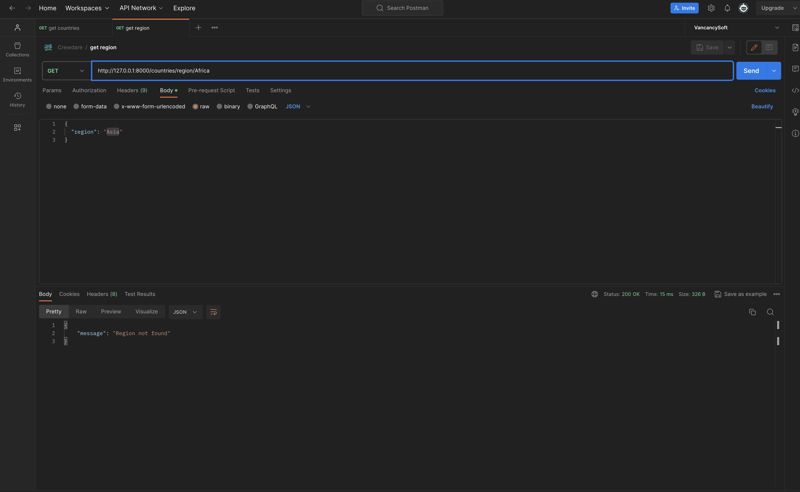

## Overview

The Country Data App is a web application that provides information about countries, including their population, capital, and flag. The app allows users to retrieve the top 10 most populous countries and filter countries by region.

## Minimum system requirements

- PHP >=8.0

After unzipping the project folder, follow these steps to run the project locally:

Open a terminal or command prompt and navigate to the project folder. Run the command npm install to install the required dependencies.

then type `composer install` after composer install finish and make sure you have php 8.0 upward then run  `php -S localhost:8000 -t public`

Access the Application: Open Postman[ https://www.postman.com/downloads/ ] then create new collection to fetch data from the route being created. here are example are it looks like 

## REST API's

 - GET /countries
 - GET /countries/region/{region}

## List Countries
- Endpoint: GET /countries
- Description: Fetch countries
- Preview
    

## Get Region
- Endpoint: GET /countries/region/{region}
- Description: Get countries Region
- Preview
    

## Running Tests
 Run  `./vendor/bin/phpunit Tests`

## Setup and Deliverables
1. Project Setup:
2. Use PHP for your backend code.
3. Set up your project using Composer for dependency management if necessary.
4. Implement a simple MVC pattern without using any frameworks.

## Approach
- Developed the application architecture and determined which parts, such as the controller, router, and service layers, are needed.
- Put the router into place to manage HTTP requests and direct them to the relevant controller methods.
- To handle  logic and communicate with the service layer, the controller layer was created.
- Created the service layer to retrieve national information from a third-party API.
- Put in place error-handling and logging systems to provide stability and debugging potential.

I selected these tools and packages because they offer a reliable and effective method for developing PHP web applications.

## Code Structure
- Router: Handles HTTP requests and routes them to controller methods
- Controller: Handles logic and interacts with the service layer
- Service: Fetches country data from an external API
- Model: Retrives country data
  
 Model-View-Controller (MVC) architecture provides a clean division of responsibilities and improves code maintainability, which is why I went with this method.

Additional Features and Improvements
 - Add more filtering options, such as filtering by language or currency
 - Implement authentication and authorization to restrict access to certain features

## Libraries and Tools
- PHPUnit for unit testing
- PHP >=8.0
- Symfony Dumper

## Evaluation Criteria

1. Code Quality - Is the code clean, organized, and easy to understand? Are PHP OOP principles used effectively throughout?
2. Functionality - Does the application meet the requirements? Does it handle API calls, data processing, and display the data correctly?
3. User Experience - Is the application easy to use and visually appealing?
4. Error Handling - Are errors and loading states managed gracefully?
5. Testing - Are there tests? Do they do anything useful?
6. Documentation - Is the code adequately commented and documented? Were the post-coding questions answered thoughtfully?